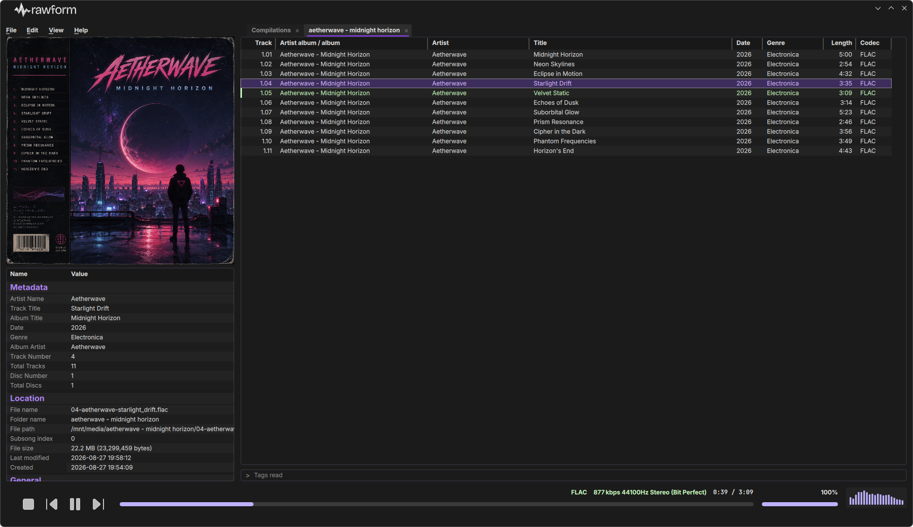

# rawform

[](https://github.com/ret2sender/rawform/actions/workflows/ci.yml)

A foobar2000-inspired desktop audio player for Linux and macOS, built with
Qt 6 / QML on top of a Qt-free C++20 audio engine. Native reference decoders
first, FFmpeg as the long-tail fallback, and bit-perfect device-rate
switching by default.



## Project layout

- **`audio/`**: the audio engine (`rawform_audio`), a command-line front-end
  (`rawform_audio_cli`), and unit tests. Qt-free; depends on libsndfile,
  libFLAC, libmpg123, libebur128, and optionally FFmpeg. Builds standalone.
- **`ui/`**: the Qt 6 / QML desktop application (`rawform`), which links the
  engine and adds TagLib and yaml-cpp.

There is no top-level `CMakeLists.txt`: these are two independent CMake
projects, and `ui/` pulls the engine in with `add_subdirectory(../audio)`.
Building the application therefore builds the engine as well; the engine's
CLI and tests are built only in a standalone engine build (`make core`).

## Usage

Tracks are added to playlists by drag and drop from Finder or your file
manager. Dropping onto the active playlist appends there; dropping onto the
tab bar opens a new tab. What lands depends on what you drop:

- **Audio files** are appended in order.
- **Folders** are walked recursively, picking up every supported audio file
  in every subfolder.
- **`.m3u` / `.m3u8` playlists** are expanded into their entries.
- **`.rwfpl` files** (rawform's own playlist format) each open in their own
  new tab.

Playlists live in tabs. Each tab is continuously persisted,
so quitting and relaunching restores every tab, in order, with the active tab
selected. Playlists can also be saved to and opened from `.rwfpl` files
explicitly.

Right-clicking a playlist's column header manages columns, including custom
columns defined with a `%pattern%` syntax in the Custom
Columns window. Column layout is persisted per playlist.

Selecting tracks and opening **Properties** shows a non-modal
window (metadata, ReplayGain, Location panes); several can be open
at once, and tag edits are written back through TagLib. The Tools menu offers
Reload info, Rewrite tags, Remove tags, and an MP3-only Optimize size.

**ReplayGain scanning** measures BS.1770 loudness with libebur128 and stages
track and album gains into the Properties window before anything is written.
Multi-album selections are bucketed into albums automatically.

The **spectrum viewer** renders a log-banded FFT of either the output or the
source signal; the **player bar** shows the codec, bitrate, sample rate, and
whether output is currently bit perfect or resampled.

**Bit-perfect playback** is on by default: the output device is switched to
each track's native sample rate when the device supports it, with a
nearest-best fallback otherwise. It can be toggled in Settings > Playback.

## Files rawform writes

Everything lives under the user config directory: `$XDG_CONFIG_HOME/rawform`,
or `~/.config/rawform` when `XDG_CONFIG_HOME` is unset (on macOS too). Inside
the Flatpak sandbox the same paths resolve to
`~/.var/app/com.rawform.app/config/rawform` automatically.

| File | Contents |
|------|----------|
| `settings.yaml` | Tagging preferences (the MP3/ID3 write settings) |
| `playback.yaml` | Master volume and mute, ReplayGain settings, output rate policy, output device selection |
| `spectrum.yaml` | Spectrum-view preferences (analyzer source) |
| `window.yaml` | Main window geometry, plus saved sizes for the tool windows (Properties, Rename To) |
| `playlist_custom_columns.yaml` | Custom column definitions |
| `rename_patterns.yaml` | Saved Rename To pattern presets |
| `columns.rwftp` | Default playlist column layout |
| `live_playlist/*.rwfpl` | One live copy per open playlist tab |
| `live_playlist/.session` | Tab order and active tab |
| `rate_ledger.yaml` | CoreAudio rate-debt crash ledger. Exists only transiently on macOS while a session holds a rate change; a crash leaves it behind and the next launch restores the device rate from it. Never appears on Linux. |

`.rwfpl` and `.rwftp` are binary formats (Qt `QDataStream`); the YAML files
are plain text. All writes are atomic (`QSaveFile`). Deleting the directory
resets the application to first-run state.

## Supported formats

Decoding is engine-side and content-sniffed: the file's leading bytes pick
the decoder cascade, the extension only biases the order, and the first
decoder that opens wins.

- **Native reference decoders**: FLAC (libFLAC), MP3 (libmpg123), and the
  libsndfile family (WAV, AIFF, and the other formats libsndfile handles,
  including Ogg Vorbis and Opus).
- **FFmpeg fallback** (optional, on by default when FFmpeg is found): AAC,
  ALAC/M4A, WMA, AC3, DTS, and the rest of the long tail. The native
  decoders are always tried first; FFmpeg only catches what they decline.

The playlist import filter (which extensions drag and drop accepts) is
hardcoded in `ui/Sources/media/TrackScanner.cpp`: flac, mp3, wav, ogg, oga,
opus, m4a, mp4, aac, wv, ape, wma, aiff, aif, mpc, tta, ac3, dts. A build
without FFmpeg imports all of these but can only play what the native
decoders cover.

Internally everything is interleaved float32. Metadata and embedded cover
art are read with TagLib, with an FFmpeg-based probe as the metadata
fallback for formats TagLib cannot parse (ac3, dts).

## Prerequisites

- CMake 4.2 or newer
- A C++20 compiler
- Qt 6 (Core, Gui, Quick, QuickControls2, Svg, Concurrent)

### macOS

Qt comes from the [Qt online installer](https://www.qt.io/download-qt-installer)
or Homebrew (`brew install qt`). The remaining dependencies come from
Homebrew:

```sh
brew install pkg-config libsndfile flac mpg123 libebur128 taglib yaml-cpp
brew install ffmpeg   # optional: enables the long-tail fallback decoder
```

TagLib must be 2.x (Homebrew's is).

### Linux

Qt comes from the [Qt online installer](https://www.qt.io/download-qt-installer)
(the Makefile auto-discovers `~/Qt/6.x.x/gcc_64`); distro Qt packages work
too, but keeping a single Qt on the machine avoids CMake finding a different
one than you expect. The remaining dependencies come from your distro's dev
packages. On Fedora:

```sh
sudo dnf install cmake gcc-c++ pkgconf libsndfile-devel flac-devel \
    mpg123-devel libebur128-devel yaml-cpp-devel pipewire-devel zlib-devel
```

TagLib needs care: the build requires 2.x together with its CMake package
config files (`find_package(TagLib 2.0 CONFIG)`), and distro packages do
not reliably provide that combination; Fedora 42's `taglib-devel` does
not. The reliable path is a pinned source build, the same module the
Flatpak bundles:

```sh
git clone --depth 1 --branch v2.1 --recurse-submodules \
    https://github.com/taglib/taglib.git /tmp/taglib-src
cmake -S /tmp/taglib-src -B /tmp/taglib-build \
    -DCMAKE_BUILD_TYPE=Release -DBUILD_SHARED_LIBS=ON \
    -DBUILD_TESTING=OFF -DBUILD_EXAMPLES=OFF
cmake --build /tmp/taglib-build
sudo cmake --install /tmp/taglib-build
```

If your distro's TagLib is 2.x and ships the config files, the package
works and the source build is unnecessary. Flatpak users are unaffected
either way; the manifest bundles TagLib itself.

`pipewire-devel` is what enables audio output on Linux:
the engine's PipeWire sink compiles in when `libpipewire-0.3` is found and
the build prints a warning (and produces a player with no output device)
without it. FFmpeg is optional as on macOS; note that Fedora's default
`ffmpeg-free` covers fewer codecs than a full FFmpeg from RPM Fusion.

Wayland and X11 are both supported; the window decorations adapt to the
desktop (a Breeze/KWin profile on KDE Plasma).

## Building

The Makefile wraps the CMake invocations. Run it from the repository root.

```sh
make                    # build the application (Debug)
make -j6                # ...with six parallel jobs
make run                # build, then run with logging on the terminal
make test               # build the engine standalone and run its unit tests
make test SANITIZE=thread   # the engine's concurrency soaks under TSan
make BUILD_TYPE=Release # release build
make help               # all targets and resolved settings
```

Qt is located automatically: an explicit `QT_PREFIX`, then Homebrew, then
the newest `~/Qt/6.x.x/macos` (macOS) or `~/Qt/6.x.x/gcc_64` (Linux),
whichever actually contains `Qt6Config.cmake`. Override if needed:

```sh
make QT_PREFIX=$HOME/Qt/6.11.1/macos
make QT_PREFIX="$(brew --prefix qt)"
```

Output lands in `build/app-debug/` or `build/app-release/`.

The FFmpeg fallback is tri-state: `make RAWFORM_FFMPEG=auto` (default,
enabled if found), `on` (required, fails loudly if missing), or `off`
(native-only). Changing it for an already-configured directory needs an
explicit `make configure RAWFORM_FFMPEG=off`.

### CLion

Open the **`ui/`** directory as the project. Because the engine is added
with an explicit binary directory, the Project panel shows both `rawform`
and `rawform_audio` and builds them together.

If CMake cannot find Qt, add its prefix under **Settings, Build, Execution,
Deployment, CMake, CMake options**:

```
-DCMAKE_PREFIX_PATH=$HOME/Qt/6.11.1/macos
```

To work on the engine and run its tests, open `audio/` as a separate
project.

### Plain CMake

The Makefile is a convenience, not a requirement:

```sh
# Application (builds the engine too)
cmake -S ui -B build/app \
      -DCMAKE_BUILD_TYPE=Release \
      -DCMAKE_PREFIX_PATH=$HOME/Qt/6.11.1/macos
cmake --build build/app

# Engine, CLI and unit tests, standalone
cmake -S audio -B build/core -DCMAKE_BUILD_TYPE=Release
cmake --build build/core
ctest --test-dir build/core
```

### Build notes

- The application's Debug builds compile with `-Wall -Wextra -Wpedantic
  -Werror` on GCC/Clang/AppleClang, so warnings fail the build; the engine
  builds with the same warnings but without `-Werror`.
- Both CMake projects offer `-DRAWFORM_SANITIZE=thread|address` (TSan, or
  ASan+UBSan together) for sanitized runs; the Makefile's `SANITIZE=` forwards
  it to the engine build and keeps a separate build directory per profile.
- QML is lint-gated: `cmake --build <dir> --target rawform_qmllint` should
  stay warning-free.
- Selecting tracks that have no cover art (no sidecar image, no embedded
  picture) would normally print one `Failed to get image from provider` QML
  warning per selection; rawform suppresses exactly that message and passes
  every other QML warning through unchanged. Set `RAWFORM_LOG_ART_MISSES=1`
  in the environment (for example in a CLion run configuration) to let the
  art-miss warnings through again for a diagnostic session.

## Packaging

### macOS

Prebuilt `.dmg` images for Apple Silicon are attached to each
[GitHub Release](https://github.com/ret2sender/rawform/releases). They are
ad-hoc signed and not notarized, so Gatekeeper objects on first launch; see
[Opening an unsigned macOS build](#opening-an-unsigned-macos-build) below
before writing the app off as broken.

To build the image yourself instead:

```sh
make BUILD_TYPE=Release bundle   # self-contained .app
make BUILD_TYPE=Release dmg      # ...and a versioned .dmg
make BUILD_TYPE=Release install  # copy to /Applications
```

`scripts/macdeploy.sh` runs `macdeployqt`, drops plugins the application
never loads (SQL drivers and the unused Qt Quick Controls styles), re-signs
the bundle ad hoc, prints the bundled non-Qt dylibs, and then reports any
library still resolving outside the bundle. Read that final report: rawform
bundles a long media chain (libsndfile, FLAC, mpg123, ebur128, TagLib,
yaml-cpp, and with FFmpeg enabled the four libav* libraries plus their codec
dependencies), and anything listed there would be missing on another
machine.

The `.dmg` is named from `ui/VERSION.txt`, e.g.
`rawform-1.0.0-macos-arm64.dmg`; non-Release builds get a `-debug` style
suffix so they cannot masquerade as releases.

### Opening an unsigned macOS build

Distributed builds are signed **ad hoc** rather than with an Apple Developer
ID, and they are not notarized. macOS will refuse to open such an app
downloaded from the internet, usually reporting that it is *damaged and
can't be opened*.

The app is not damaged. That is Gatekeeper's response to an unrecognized
signature on a quarantined file. Clear the quarantine attribute:

```sh
xattr -dr com.apple.quarantine /Applications/rawform.app
```

This is needed once per downloaded copy; the app opens normally from then
on. The classic alternative, right-click (or Control-click) the app and
choose **Open**, reliably handles Gatekeeper's milder "unidentified
developer" prompt but on recent macOS is often refused outright for the
"damaged" phrasing, which is why the command above is the path this README
leads with.

Signing with a Developer ID and notarizing removes this step entirely. It
requires a paid Apple Developer account and is not currently done.

### Linux (Flatpak)

The supported install path on Linux is the Flatpak. Prebuilt x86_64 bundles
are attached to each
[GitHub Release](https://github.com/ret2sender/rawform/releases); rawform is
not on Flathub yet (submission is a separate, future effort), so there is no
store listing to search for.

```sh
flatpak install --user rawform-1.0.0-x86_64.flatpak
flatpak run com.rawform.app
```

The bundle knows where to fetch its runtime (`org.kde.Platform//6.11` from
Flathub), so a machine without it is offered the download during install. If
that fetch fails to resolve, the machine has no usable Flathub remote; some
distros preconfigure Flathub in a disabled or filtered state (Fedora live
sessions, for example). Register it yourself, then retry:

```sh
flatpak remote-add --user --if-not-exists flathub https://dl.flathub.org/repo/flathub.flatpakrepo
```

On other architectures, or to build from source, use the manifest directly:

```sh
# One-time: register Flathub if this machine never has (harmless if it
# already is), then install the runtime and SDK the manifest targets.
# Unlike the bundle install above, flatpak-builder does not fetch these
# itself.
flatpak remote-add --user --if-not-exists flathub https://dl.flathub.org/repo/flathub.flatpakrepo
flatpak install --user flathub org.kde.Platform//6.11 org.kde.Sdk//6.11

# If a dev build's desktop integration was ever installed, remove it first
# so it cannot shadow the Flatpak's exported .desktop and icon:
ui/tools/install_linux_icons.sh --uninstall

# Build from a scratch directory OUTSIDE the repo (flatpak-builder drops
# state and stray files into the CWD):
mkdir -p ~/build/rawform-flatpak && cd ~/build/rawform-flatpak
flatpak-builder --user --install --force-clean \
    build-flatpak /path/to/rawform/packaging/flatpak/com.rawform.app.yml

flatpak run com.rawform.app
```

The manifest (`packaging/flatpak/com.rawform.app.yml`) bundles the audio
libraries the KDE runtime does not ship (FLAC, mpg123, libsndfile,
libebur128, TagLib, yaml-cpp, FFmpeg) and talks to PipeWire directly through
`xdg-run/pipewire-0`, which is what preserves bit-perfect device-rate
switching inside the sandbox. Its header comments document every sandbox
permission and pinning decision.

For plain (non-Flatpak) dev builds, `ui/tools/install_linux_icons.sh`
installs the per-user `.desktop` entry and icon so the desktop shows the
correct name and icon for the running app; `--uninstall` removes them.

## Licensing

rawform is licensed under the **GNU General Public License v3.0 or later**
[`LICENSE`](LICENSE). Third-party components bundled with or linked by the
project, including the FFmpeg libraries and their codec dependencies that
ship inside packaged builds, are listed in [`THIRD-PARTY-NOTICES.md`](THIRD-PARTY-NOTICES.md).
